## prueba
# Bienvenido al bootcamp de LarnU 👽

## Homeworks

En este [link](#) vas a encontrar el repositorio con las homeworks de cada unidad en su correspondiente carpeta.

## Canales de DISCORD

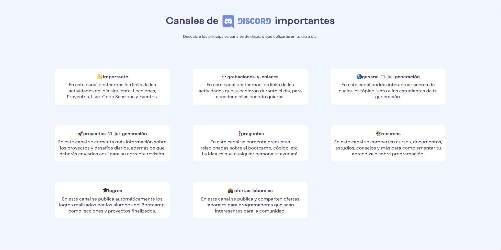


## Editores de Texto

Los editores de código son programas que nos ayudan a gestionar el código fuente de nuestros proyectos. Son ideales cuando se trabaja con diferentes lenguajes de programación, alternándolos o en un solo proyecto (por ejemplo, en un proyecto web es muy habitual combinar html, javascript, css, php, etc.).

Hay varios editores de código, pero en este bootcamp trabajaremos con Visual Studio Code.

### Visual Studio Code

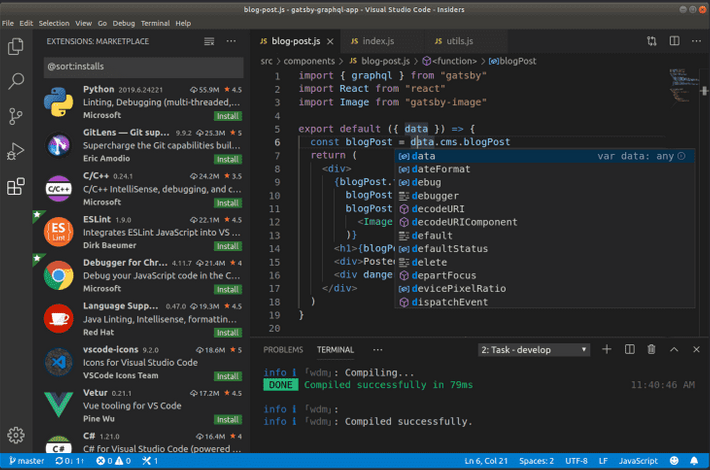

Es un editor desarrollado por Microsoft.

Tiene integrado el control de versiones mediante Git y Github para tener un seguimiento de tus proyectos. Brinda una cantidad de extensiones que facilitan el trabajo de un desarrollador.

Para descargarlo, nos dirigimos al sitio oficial, en la sección Dowload y descargamos el instalador según nuestro Sistema Operativo:

<https://code.visualstudio.com/download>

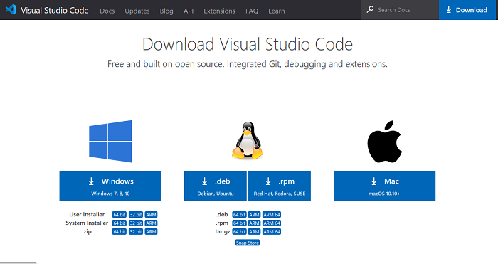

Una vez finalizada la descarga, procedemos a ejecutar el instalador.

## Instalando Node.JS

Para instalar Node js en nuestra computadora, nos dirigimos al sitio oficial:

<https://nodejs.org/es/>

Al ingresar, el sitio detectará nuestro Sistema Operativo y nos sugerirá que descarguemos el instalador adecuado.

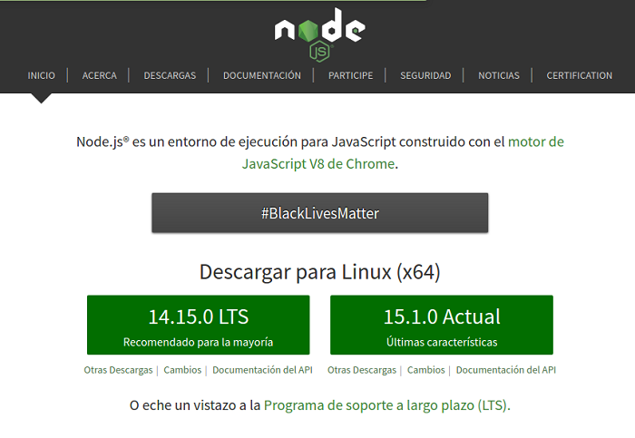

Para proceder a la descarga, seleccionamos la versión LTS, que es la versión estable.
Una vez finalizada la descarga, procedemos a ejecutar el instalador.

Para corroborar que Node js se instaló correctamente, procedemos a ejecutar el siguiente comando por la consola o terminal de nuestro sistema operativo:

```shell
node -v
```

Y si seguimos los pasos anteriores, la consola o terminal, nos devolverá la versión de Node js que tenemos instalada:

```shell
v12.18.3
```

<br>
<br>

# GIT

## ¿Por qué usar un sistema de control de versiones como Git?
Un sistema de control de versiones como Git nos ayuda a guardar el historial de cambios y crecimiento de los archivos de nuestro proyecto.

En realidad, los cambios y diferencias entre las versiones de nuestros proyectos pueden tener similitudes, algunas veces los cambios pueden ser solo una palabra o una parte específica de un archivo específico. Git está optimizado para guardar todos estos cambios de forma atómica e incremental, o sea, aplicando cambios sobre los últimos cambios, estos sobre los cambios anteriores y así hasta el inicio de nuestro proyecto.

## ¿Qué es Git?

Git es un sistema de control de versiones distribuido, diseñado por Linus Torvalds. Está pensando en la eficiencia y la confiabilidad del mantenimiento de versiones de aplicaciones cuando estas tienen un gran número de archivos de código fuente.

Git está optimizado para guardar cambios de forma incremental.

Permite contar con un historial, regresar a una versión anterior y agregar funcionalidades.

Lleva un registro de los cambios que otras personas realicen en los archivos.

Git fue diseñado para operar en un entorno Linux. Actualmente, es multiplataforma, es decir, es compatible con Linux, MacOS y Windows. En la máquina local se encuentra Git, se utiliza bajo la terminal o línea de comandos y tiene comandos como merge, pull, add, commit y rebase, entre otros.

## Instalación

### Para Mac y Linux

Ver estos enlaces:

<https://git-scm.com/book/es/v2/Inicio---Sobre-el-Control-de-Versiones-Instalaci%C3%B3n-de-Git>

<https://www.youtube.com/watch?v=PSULlxUk744>

<https://www.youtube.com/watch?v=oV0spTF71AI>

### Para Windows

Ingreso a <https://git-scm.com> y descargo la útlima versión.

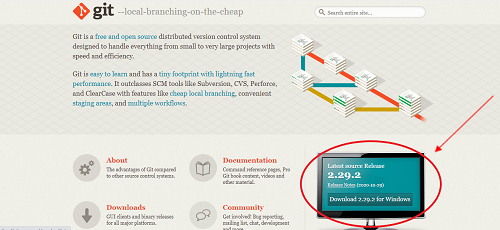

Una vez descargado, se abre el archivo .exe y van a visualizar la siguiente ventana

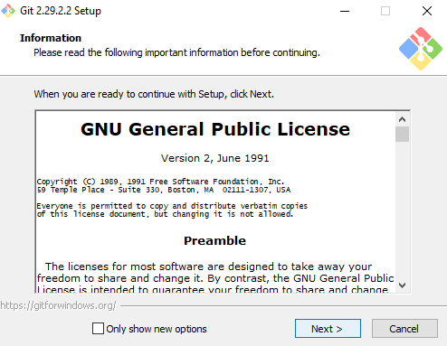

Clickeamos “Next” hasta que llegamos a esta parte:

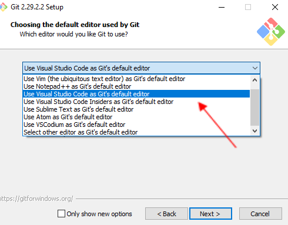

En este momento de la instalación si quieres puedes elegir el editor de texto que van a usar. (Importante, ténganlo instalado antes de instalar Git)

Seguimos clickeando “Next” y luego “Install”

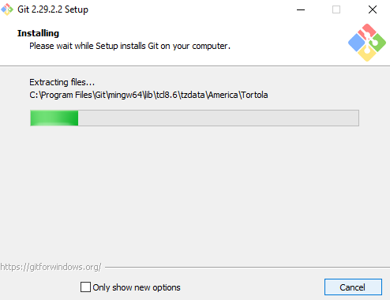

Por último, finalizar! Si seleccionan la opción "Launch Git Bash", una vez que finalizan la instalación se va a abrir la consola

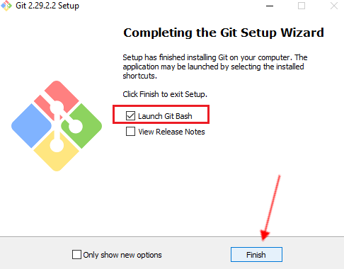

Otra forma de abrir la consola es haciendo click derecho sobre el escritorio y elegir la opción "Git Bash Here"

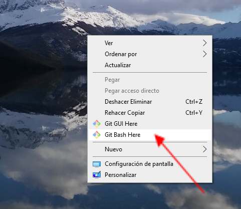

Una vez instalado Git van a poder visualizar la consola: ingresamos el comando `git --version` para chequear que está instalado. Si ven la consola así, ya están listos para comenzar a trabajar!

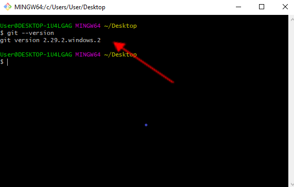


## Uso de Git

Existen muchas formas de usar Git. Por un lado tenemos las herramientas originales de línea de comandos, y por otro lado tenemos una gran variedad de interfaces de usuario con distintas capacidades. 

## Historia de Git

Como muchas de las grandes cosas en esta vida, **Git** comenzó con un poco de destrucción creativa y encendida polémica. El núcleo de Linux es un proyecto de software de código abierto con un alcance bastante grande. Durante la mayor parte del mantenimiento del núcleo de Linux (1991-2002), los cambios en el software se pasaron en forma de parches y archivos. En 2002, el proyecto del núcleo de Linux empezó a usar un DVCS propietario llamado **BitKeeper**.

En 2005, la relación entre la comunidad que desarrollaba el núcleo de Linux y la compañía que desarrollaba BitKeeper se vino abajo, y la herramienta dejó de ser ofrecida gratuitamente. Esto impulsó a la comunidad de desarrollo de Linux (y en particular a Linus Torvalds, el creador de Linux) a desarrollar su propia herramienta basada en algunas de las lecciones que aprendieron durante el uso de BitKeeper. Algunos de los objetivos del nuevo sistema:

- Velocidad
- Diseño sencillo
- Fuerte apoyo al desarrollo no lineal (miles de ramas paralelas)
- Completamente distribuido
- Capaz de manejar grandes proyectos (como el núcleo de Linux) de manera eficiente (velocidad y tamaño de los datos)

Desde su nacimiento en 2005, Git ha evolucionado y madurado para ser fácil de usar y aún conservar estas cualidades iniciales. Es tremendamente rápido, muy eficiente a gran escala, y tiene un increíble sistema de ramificación (branching) para desarrollo no lineal.

## Comenzando a usar Git

## Conceptos importantes de Git

- Bug: Error en el código

- Repository: Donde se almacena todo el proyecto, el cual puede vivir tanto en local como en remoto. El repositorio guarda un historial de versiones y, más importante, de la relación de cada versión con la anterior para que pueda hacerse el árbol de versiones con las diferentes ramas.

- Fork: Si en algún momento queremos contribuir al proyecto de otra persona, o si queremos utilizar el proyecto de otro como el punto de partida del nuestro. Esto se conoce como “fork”.

- Clone: Una vez se decide hacer un fork , hasta ese momento sólo existe en GitHub. Para poder trabajar en el proyecto, toca clonar el repositorio elegido al computador personal.

- Branch: Es una bifurcación del proyecto que se está realizando para anexar una nueva funcionalidad o corregir un bug.

- Master: Rama donde se almacena la última versión estable del proyecto que se está realizando. La rama master es la que está en producción en cada momento (o casi) y debería estar libre de bugs. Así, si esta rama está en producción, sirve como referente para hacer nuevas funcionalidades y/o arreglar bugs de última hora.

- Commit: consiste en subir cosas a la versión local del repositorio. De esta manera se puede trabajar en la rama de forma local sin tener que modificar ninguna versión en remoto ni tener que tener la última versión remota, cosa muy útil en grandes desarrollos trabajados por varias personas.

- Push: Consiste en enviar todo lo que se ha confirmado con un commit al repositorio remoto. Aquí es donde se une nuestro trabajo con el de los demás.

- Checkout: Acción de descargarse una rama del repositorio GIT local (sí, GIT tiene su propio repositorio en local para poder ir haciendo commits) o remoto.

- Fetch: Actualiza el repositorio local bajando datos del repositorio remoto al repositorio local sin actualizarlo, es decir, se guarda una copia del repositorio remoto en el local.

- Merge: La acción de merge es la continuación natural del fetch. El merge permite unir la copia del repositorio remoto con tu repositorio local, mezclando los diferentes códigos.

- Pull: Consiste en la unión del fetch y del merge, esto es, recoge la información del repositorio remoto y luego mezcla el trabajo en local con esta.

- Diff: Se utiliza para mostrar los cambios entre dos versiones del mismo archivo.
## Comandos básicos

- `git init`: se utiliza para iniciar nuestro repositorio.
- `git add ArchivoEjemplo.html`: crea el archivo pero no lo guarda de forma definitiva, lo almacena en (Staging Area).
- `git commit -m "versión 1"`: aquí se generan cambios de "Staging Area" y con ( -m "") se deja un mensaje que nos sea útil.
- `git add .`: Agrega los archivos actualizados al repositorio, pero únicamente en la carpeta que te encuentras.
- `git commit -m "Cambios v1"`: sirve para generar cambios sobre la versión antigua.
- `git status`: sirve para revisar si has modificado o guardado los cambios hechos.
- `git log "archivo.txt"`: sirve para ver el historial del archivo.
- `git push`: sirve para enviar cambios al repositorio remoto.
- `git pull`: sirve para recibir cambios de repositorio remoto a local.
- `ls`: listado de carpetas en donde me encuentro. Es decir, como emplear dir en windows.
- `pwd`: ubicación actual
- `mkdir`: make directory nueva carpeta
- `touch archivo.extensión`: crear archivo vacío
- `cat archivo.extensión`: muestra el contenido del archivo
- `history`: historial de comandos utilizados durante esa sesión
- `rm archivo.extensión`: Eliminación de archivo
- `--help`: ayuda sobre el comando
- `git checkout`: traer cambios realizados
- `git rm --cached archivo.extensión`: se utiliza para devolver el archivo que se tiene en ram. Cuando escribimos git add, lo devuelve a estado natural mientras está en staging.
- `git config --list`: muestra la lista de configuración de git
- `git config --list --show-origin`: rutas de acceso a la configuración de git
- `git log archivo.extensión`: muestra la historia del archivo

## Ciclos de vida o estados de los archivos en Git

Para iniciar un repositorio, o sea, activar el sistema de control de versiones de Git en tu proyecto, solo debes ejecutar el comando `git init`.

Este comando se encargará de dos cosas: primero, crear una carpeta `.git`, donde se guardará toda la base de datos con cambios atómicos de nuestro proyecto; y segundo, crear un área que conocemos como Staging, que guardará temporalmente nuestros archivos (cuando ejecutemos un comando especial para eso) y nos permitirá, más adelante, guardar estos cambios en el repositorio (también con un comando especial).

Por otro lado cuando trabajamos con Git nuestros archivos pueden vivir y moverse entre 4 diferentes estados (cuando trabajamos con repositorios remotos pueden ser más estados, pero lo estudiaremos más adelante):

- **Archivos** ***Tracked***: son los archivos que viven dentro de Git, no tienen cambios pendientes y sus últimas actualizaciones han sido guardadas en el repositorio gracias a los comandos `git add` y `git commit`.

- **Archivos** ***Staged***: son archivos en staging. Viven dentro de Git y hay registro de ellos por que han sido afectados por el comando `git add`, aunque no sus últimos cambios. Git ya sabe de la existencia de estos últimos cambios, pero todavía no han sido guardados definitivamente en el repositorio por que falta ejecutar el comando `git commit`.

- **Archivos** ***Unstaged***: entiendelos como archivos "Traked pero Unstaged". Son archivos que viven dentro de Git pero no han sido afectados por el comando `git add` ni mucho menos por `git commit`. Git tiene un registro de estos archivos, pero esta desactualizado, sus últimas versiones solo estan guardadas en su disco duro.

- **Archivos** ***Untracked***: son archivos que NO viven dentro de Git, solo en el disco duro. Nunca han sido afectados por `git add`, asi que Git no tiene registro de su existencia. 
Recuerda que hay un caso muy raro donde los archivos tienen dos estados al mismo tiempo: Staged y Untracked. Esto pasa cuando guardas los cambios de un archivo en el área de Staging (con el comando `git add`), pero antes de hacer commit para guardar los cambios en el repositorio haces nuevos cambios que todavía no han sido guardados en el área de Staging (en realidad, todo sigue funcionando igual pero es un poco divertido).

### Comandos para mover archivos entre los estados de Git

- `git status`: nos permite ver el estado de todos nuestros archivos y carpetas.

- `git add`: nos ayuda a mover archivos del Untracked o Unstaged al estado Staged. Podemos usar git nombre del archivo o carpeta para añadir archivos y carpetas individuales o git add -a para mover todos los archivos de nuestro proyecto ( tanto Untrackeds como Unstageds).

- `git reset HEAD`: nos ayuda a sacar los archivos del estado Staged para devolverlos a su estado anterior. Si los archivos venian de Unstaged, vuelven alli. Y lo mismo si venian de Untracked.

- `git commit`: nos ayuda a mover archivos de Unstaged a Tracked. Esta es una ocasión especial, los archivos han sido guardados o actualizados en el repositorio. Git nos pedira que dejemos un mensaje para recordar los cambios que hicimos y podemos usar el argumento -m para describirlo ( git commit -m "mensaje").

- `git rm`: este comando necesita algunos de los argumentos para poder ejecutarse correctamente:

- `git rm --cached`: Mueve los archivos que le indiquemos al estado Untracked.
- `git rm --force`: Elimina los archivos de Git y del disco duro. Git guarda el registro de la existencia de los archivos, por lo que podremos recuperarlos si es necesario (pero debemos usar comandos más avanzados).

## Qué es un Branch y cómo funciona un Merge?

En otras palabras, un branch o rama en Git es una rama que proviene de otra. Imagina un árbol, que tiene una rama gruesa, y otra más fina, en la rama más gruesa tenemos los commits principales y en la rama fina tenemos otros commits que pueden ser de hotfix, devlopment entre otros.ㅤ
Estas son las ramas base de un proyecto en Git:

Estándar de equipos de desarrollo..

- Rama ***Master*** o ***Main***: Por defecto, el proyecto se crea en una rama llamada Main (anteriormente conocida como Master). Cada vez que añades código y guardas los cambios, estás haciendo un commit, que es añadir el nuevo código a una rama. Esto genera nuevas versiones de esta rama o branch, hasta llegar a la versión actual de la rama Main.
- Rama ***Development***: Cuando decides hacer experimentos, puedes generar ramas experimentales (usualmente llamadas development), que están basadas en alguna rama main, pero sobre las cuales puedes hacer cambios a tu gusto sin necesidad de afectar directamente al código principal.
- Rama ***Hotfix***: En otros casos, si encuentras un bug o error de código en la rama Main (que afecta al proyecto en producción), tendrás que crear una nueva rama (que usualmente se llaman bug fixing o hot fix) para hacer los arreglos necesarios. Cuando los cambios estén listos, los tendrás que fusionar con la rama Main para que los cambios sean aplicados. Para esto, se usa un comando llamado Merge, que mezcla los cambios de la rama que originaste a la rama Main.

### Cómo hacer merge

Producir una nueva rama se conoce como Checkout. Unir dos ramas lo conocemos como Merge.

Cuando haces merge de estas ramas con el código principal, su código se fusiona originando una nueva versión de la rama master (o main) que ya tiene todos los cambios que aplicaste en tus experimentos o arreglos de errores.

Podemos generar todas las ramas y commits que queramos. De hecho, podemos aprovechar el registro de cambios de Git para producir ramas, traer versiones viejas del código, arreglarlas y combinarlas de nuevo para mejorar el proyecto.

Solo ten en cuenta que combinar estas ramas (hacer “merge”) puede generar conflictos. Algunos archivos pueden ser diferentes en ambas ramas. Git es muy inteligente y puede intentar unir estos cambios automáticamente, pero no siempre funciona. En algunos casos, somos nosotros los que debemos resolver estos conflictos a mano.

## Analizar cambios en los archivos de tu proyecto con Git

El comando git show nos muestra los cambios que han existido sobre un archivo y es muy útil para detectar cuándo se produjeron ciertos cambios, qué se rompió y cómo lo podemos solucionar. Pero podemos ser más detallados.

Si queremos ver la diferencia entre una versión y otra, no necesariamente todos los cambios desde la creación del archivo, podemos usar el comando git diff commitA commitB.

Recuerda que puedes obtener el ID de tus commits con el comando git log.

## Volver en el tiempo en nuestro repositorio utilizando reset y checkout

El comando `git checkout` + `ID del commit` nos permite viajar en el tiempo. Podemos volver a cualquier versión anterior de un archivo específico o incluso del proyecto entero. Esta también es la forma de crear ramas y movernos entre ellas.

También hay una forma de hacerlo un poco más “ruda”: usando el comando `git reset`. En este caso, no solo “volvemos en el tiempo”, sino que borramos los cambios que hicimos después de este commit.

Hay dos formas de usar `git reset`: con el argumento `--hard`, borrando toda la información que tengamos en el área de staging (y perdiendo todo para siempre). O, un poco más seguro, con el argumento `--soft`, que mantiene allí los archivos del área de staging para que podamos aplicar nuestros últimos cambios pero desde un commit anterior.

Cómo usar Git Reset
Para volver a commits previos, borrando los cambios realizados desde ese commit, podemos utilizar:

- `git reset --soft [SHA 1]`: elimina los cambios hasta el staging area
- `git reset --mixed [SHA 1]`: elimina los cambios hasta el working area
- `git reset --hard [SHA 1]`: regresa hasta el commit del [SHA-1]
Donde el SHA-1 es el identificador del commit

## Git reset vs. Git rm

### git rm

Este comando nos ayuda a eliminar archivos de Git sin eliminar su historial del sistema de versiones. Esto quiere decir que si necesitamos recuperar el archivo solo debemos “viajar en el tiempo” y recuperar el último commit antes de borrar el archivo en cuestión.

Recuerda que git rm no puede usarse así nomás. Debemos usar uno de los flags para indicarle a Git cómo eliminar los archivos que ya no necesitamos en la última versión del proyecto:

- `git rm --cached`: Elimina los archivos de nuestro repositorio local y del área de staging, pero los mantiene en nuestro disco duro. Básicamente le dice a Git que deje de trackear el historial de cambios de estos archivos, por lo que pasaran a un estado untracked.
- `git rm --force`: Elimina los archivos de Git y del disco duro. Git siempre guarda todo, por lo que podemos acceder al registro de la existencia de los archivos, de modo que podremos recuperarlos si es necesario (pero debemos usar comandos más avanzados).

### git reset

Este comando nos ayuda a volver en el tiempo. Pero no como git checkout que nos deja ir, mirar, pasear y volver. Con git reset volvemos al pasado sin la posibilidad de volver al futuro. Borramos la historia y la debemos sobreescribir. No hay vuelta atrás.

Este comando es muy peligroso y debemos emplearlo solo en caso de emergencia. Recuerda que debemos usar alguna de estas dos opciones:

Hay dos formas de utilizar git reset: con el argumento --hard, borrando toda la información que tengamos en el área de staging (y perdiendo todo para siempre). O, un poco más seguro, con el argumento --soft, que mantiene allí los archivos del área de staging para que podamos aplicar nuestros últimos cambios pero desde un commit anterior.

- `git reset --soft`: Borramos todo el historial y los registros de Git pero guardamos los cambios que tengamos en Staging, así podemos aplicar las últimas actualizaciones a un nuevo commit.
- `git reset --hard`: Borra todo. Todo todito, absolutamente todo. Toda la información de los commits y del área de staging se borra del historial.

¡Pero todavía falta algo!

- `git reset HEAD`: Este es el comando para sacar archivos del área de staging. No para borrarlos ni nada de eso, solo para que los últimos cambios de estos archivos no se envíen al último commit, a menos que cambiemos de opinión y los incluyamos de nuevo en staging con git add, por supuesto.

## ¿Por qué esto es importante?

### Imagina el siguiente caso:

Hacemos cambios en los archivos de un proyecto para una nueva actualización. Todos los archivos con cambios se mueven al área de staging con el comando git add. Pero te das cuenta de que uno de esos archivos no está listo todavía. Actualizaste el archivo, pero ese cambio no debe ir en el próximo commit por ahora.

### ¿Qué podemos hacer?

Bueno, todos los cambios están en el área de Staging, incluido el archivo con los cambios que no están listos. Esto significa que debemos sacar ese archivo de Staging para poder hacer commit de todos los demás.

¡Al usar git rm lo que haremos será eliminar este archivo completamente de git! Todavía tendremos el historial de cambios de este archivo, con la eliminación del archivo como su última actualización. Recuerda que en este caso no buscábamos eliminar un archivo, solo dejarlo como estaba y actualizarlo después, no en este commit.

En cambio, si usamos git reset HEAD, lo único que haremos será mover estos cambios de Staging a Unstaged. Seguiremos teniendo los últimos cambios del archivo, el repositorio mantendrá el archivo (no con sus últimos cambios, pero sí con los últimos en los que hicimos commit) y no habremos perdido nada.

Conclusión: Lo mejor que puedes hacer para salvar tu puesto y evitar un incendio en tu trabajo es conocer muy bien la diferencia y los riesgos de todos los comandos de Git.

## Flujo de trabajo básico con un repositorio remoto

Cuando empiezas a trabajar en un entorno local, el proyecto vive únicamente en tu computadora. Esto significa que no hay forma de que otros miembros del equipo trabajen en él.

Para solucionar esto, utilizamos los servidores remotos: un nuevo estado que deben seguir nuestros archivos para conectarse y trabajar con equipos de cualquier parte del mundo.

Estos servidores remotos pueden estar alojados en GitHub, GitLab, BitBucket, entre otros. Lo que van a hacer es guardar el mismo repositorio que tienes en tu computadora y darnos una URL con la que todos podremos acceder a los archivos del proyecto. Así, el equipo podrá descargarlos, hacer cambios y volverlos a enviar al servidor remoto para que otras personas vean los cambios, comparen sus versiones y creen nuevas propuestas para el proyecto.

Esto significa que debes aprender algunos nuevos comandos

### Comandos para trabajo remoto con GIT

- `git clone url_del_servidor_remoto`: Nos permite descargar los archivos de la última versión de la rama principal y todo el historial de cambios en la carpeta .git.
- `git push`: Luego de hacer git add y git commit debemos ejecutar este comando para mandar los cambios al servidor remoto.
- `git fetch`: Lo usamos para traer actualizaciones del servidor remoto y guardarlas en nuestro repositorio local (en caso de que hayan, por supuesto).
- `git merge`: También usamos el comando git merge con servidores remotos. Lo necesitamos para combinar los últimos cambios del servidor remoto y nuestro directorio de trabajo.
- `git pull`: Básicamente, git fetch y git merge al mismo tiempo.

## Introducción a las ramas o branches de Git

Las ramas son la forma de hacer cambios en nuestro proyecto sin afectar el flujo de trabajo de la rama principal. Esto porque queremos trabajar una parte muy específica de la aplicación o simplemente experimentar.

La cabecera o HEAD representan la rama y el commit de esa rama donde estamos trabajando. Por defecto, esta cabecera aparecerá en el último commit de nuestra rama principal. Pero podemos cambiarlo al crear una rama (`git branch rama`, `git checkout -b rama`) o movernos en el tiempo a cualquier otro commit de cualquier otra rama con los comandos (`git reset id-commit`, `git checkout rama-o-id-commit`).

### Cómo funcionan las ramas en GIT

Las ramas son la manera de hacer cambios en nuestro proyecto sin afectar el flujo de trabajo de la rama principal. Esto porque queremos trabajar una parte muy específica de la aplicación o simplemente experimentar.

- `git branch -nombre de la rama-`: Con este comando se genera una nueva rama.
- `git checkout -nombre de la rama-`: Con este comando puedes saltar de una rama a otra.
- `git checkout -b rama`: Genera una rama y nos mueve a ella automáticamente, Es decir, es la combinación de git brach y git checkout al mismo tiempo.
- `git reset id-commit`: Nos lleva a cualquier commit no importa la rama, ya que identificamos el id del tag., eliminando el historial de los commit posteriores al tag seleccionado.
- `git checkout rama-o-id-commit`: Nos lleva a cualquier commit sin borrar los commit posteriores al tag seleccionado.

## Fusión de ramas con Git merge

El comando git merge nos permite crear un nuevo commit con la combinación de dos ramas o branches (la rama donde nos encontramos cuando ejecutamos el comando y la rama que indiquemos después del comando).

Cómo usar Git merge
En este ejemplo, vamos a crear un nuevo commit en la rama master combinando los cambios de una rama llamada cabecera:

```shell
git checkout master
git merge cabecera
```

Otra opción es crear un nuevo commit en la rama cabecera combinando los cambios de cualquier otra rama:

```shell
git checkout cabecera
git merge cualquier-otra-rama
```

Asombroso, ¿verdad? Es como si Git tuviera superpoderes para saber qué cambios queremos conservar de una rama y qué otros de la otra. El problema es que no siempre puede adivinar, sobre todo en algunos casos donde dos ramas tienen actualizaciones diferentes en ciertas líneas en los archivos. Esto lo conocemos como un conflicto.

Recuerda que al ejecutar el comando git checkout para cambiar de rama o commit puedes perder el trabajo que no hayas guardado. Guarda siempre tus cambios antes de hacer git checkout.

<br>
<br>

# GITHUB

Github es una plataforma que nos permite guardar repositorios de git que podemos usar como servidores remotos y ejecutar algunos comandos de forma visual e interactiva (sin necesidad de consola de mandos).

Luego de crear nuestra cuenta, podemos crear o importar repositorios, crear organizadores y proyectos de trabajo, descubrir respositorios de otras personas, contribuir a esos proyectos, dar estrellas y muchas otras cosas.

El Readme.md es el archivo que veremos por defecto al entrar en un repositorio. Es una muy buena práctica configurarlo para describir el proyecto, los requerimientos y las instrucciones que debemos seguir para contribuir correctamente.

Para clonar un repositorio desde GitHub (o cualquier otro servidor remoto) debemos copiar el URL (por ahora, usando HTTPS) y ejecutar el comando git clone + la URL que acabamos de copiar. Esto descargara la versión de nuestro proyecto que se encuentra en GitHub.

Sin embargo, esto solo funciona para las personas que quieren empezar a contribuir en el proyecto. Si queremos conectar el repositorio de GitHub con nuestro repositorio local, el que creamos con git init, debemos ejecutar las siguientes instrucciones:

- **Primero:** Guardar la URL del repositorio de GitHub con el nombre de origin

```bash
git remote add origin <URL>
```

- **Segundo**: Verificar que la URL se haya guardado correctamente

```bash
git remote
git remote -v
```

- **Tercero**: Traer la versión del repositorio remoto y hacer merge para crear un commit con los archivos de ambas partes. Podemos usar git fetch y git merge o solo git pull con el flag --allow-unrelated-histories:

```bash
git pull origin master--allow-unrelated-histories
```

- Por último, ahora sí podemos hacer git push para guardar los cambios de nuestro repositorio local en GitHub

```bash
git push origin master
```

## Comenzando

1. Para comenzar nos creamos una cuenta --- > <https://github.com> 🚀

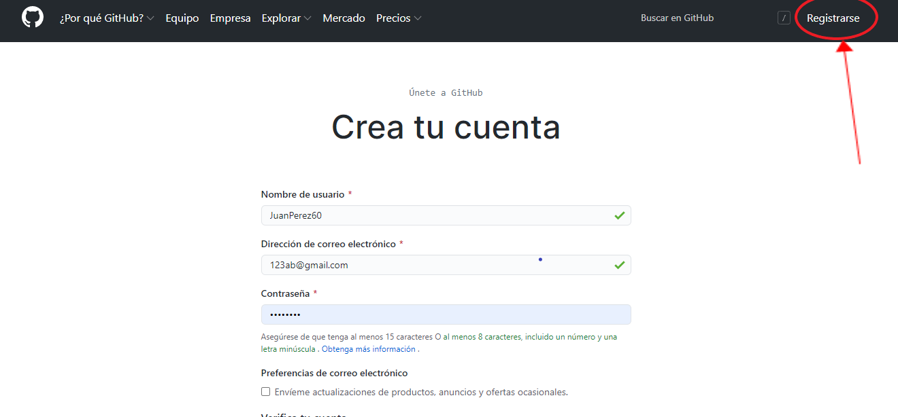

2. Una vez registrados, ingresamos con usuario y contraseña:

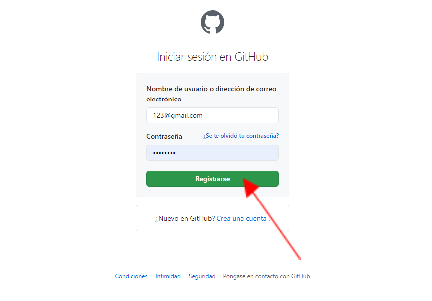

3. Listo! Ahora vemos una página de inicio como la siguiente:

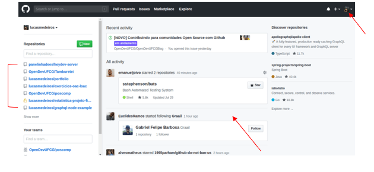

A la izquierda tenemos un acceso rápido a **mis repositorios**.

En el centro vemos la actividad de los usuarios a quienes seguimos.

En la parte superior derecha, vemos nuestra imagen de perfil. Desde ahí podemos desplegar opciones para gestionar nuestro perfil, repositorios y configuración. Si accedemos a nuestro perfil encontramos algo parecido a esto:

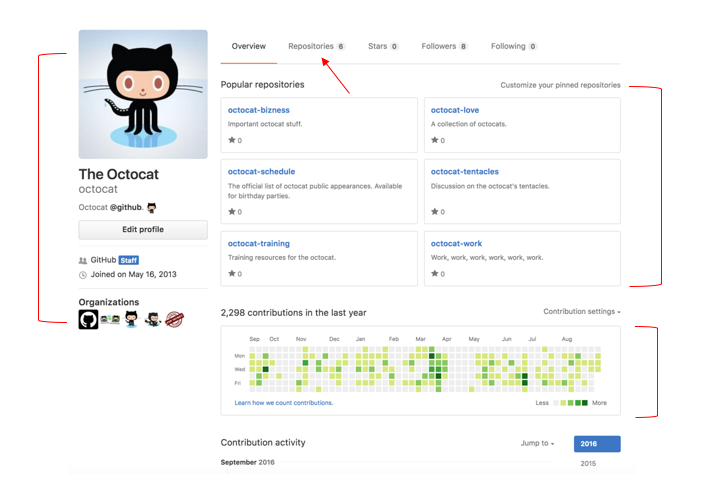

Podemos poner una foto de perfil, editar el nombre, agregar la ubicación, link y organizaciones a las que pertenecemos. En el centro podemos fijar los repositorios que queremos mostrar para que estén visibles en nuestro perfil.

Más abajo se muestra un diagrama de todas las contribuciones que vamos haciendo a los repositorios.

Si accedemos a la pestaña de arriba que dice `repositorios` veremos una lista de todos ellos. Cuando elegimos un repositorio para ver, nos lleva a una página como esta:

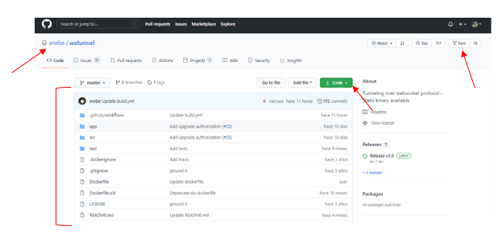

Así se ve un repositorio. Arriba a la izquierda tenemos el `nombre de usuario/nombre del repo`.

En el centro podemos ver todos los archivos que tiene dentro el repo. El botón verde que dice `Code` es importante, si clickeamos ahí vamos a poder obtener la url del repo, para así poder **_clonarlo_** (esto lo veremos más adelante).

Arriba a la derecha encontramos tres botones. `Watch` nos permite seguir un repositorio, mientras que con `Star` podemos marcar como favorito un repo que nos guste. Por último tenemos `Fork`, este es **muy** importante, lo vamos a necesitar cuando hagamos el **_Challenge!_**

Ya tenemos todo para empezar... Éxitos!!! 🍀

### Manejo de ramas en GitHub

Puedes trabajar con ramas que nunca enviamos a GitHub, así como pueden haber ramas importantes en GitHub que nunca usas en el repositorio local. Lo importante es que aprendas a manejarlas para trabajar profesionalmente.

- **Crear una rama en el repositorio local**:

```bash
git branch "nombre de la rama" 
o 
git checkout -b "nombre de la rama"
```

- **Publicar una rama local, al repositorio remoto**:

```bash
git push origin "nombre de la rama"
```

Recuerda que podemos ver gráficamente nuestro entorno y flujo de trabajo local con Git usando el comando `gitk`.

#### Configurar múltiples colaboradores en un repositorio de GitHub

Por defecto, cualquiera puede clonar o descargar tu proyecto desde GitHub, pero no pueden crear commits, ni ramas ni nada.

Existen varias formas de solucionar esto para poder aceptar contribuciones. Una de ellas es añadir a cada persona de nuestro equipo como colaborador de nuestro repositorio.

Solo debemos entrar a la configuración de colaboradores de nuestro proyecto (Repositorio > Settings > Collaborators) y añadir el email o username de los nuevos colaboradores.

#### Flujo de trabajo profesional con ***pull requests***

En un entorno profesional normalmente se bloquea la rama master, y para enviar código a dicha rama pasa por un code review y luego de su aprobación se unen códigos con los llamados merge request.

Para realizar pruebas enviamos el código a servidores que normalmente los llamamos Staging develop (servidores de pruebas) luego de que se realizan las pruebas pertinentes tanto de código como de la aplicación estos pasan a el servidor de producción con el ya antes mencionado merge request.

#### Ignorar archivos en el Repositorio con ***.gitignore***

No todos los archivos que agregas a un proyecto deberían ir a un repositorio, por ejemplo cuando tienes un archivo donde están tus contraseñas que comúnmente tienen la extensión ***.env*** o cuando te estas conectando a una base de datos, son archivos que nadie debe ver.

#### Reconstruir commits en Git con ***amend***

A veces hacemos un commit, pero resulta que no queríamos mandarlo porque faltaba algo más. Utilizamos `git commit --amend`, amend en inglés es remendar y lo que hará es que los cambios que hicimos nos los agrega al commit anterior.

#### Git ***reset*** y ***reflog***: úsese en caso de emergencia

¿Qué pasa cuando todo se rompe y no sabemos qué está pasando?

Con git reset hashDelHEAD nos devolvemos al estado en que el proyecto funcionaba.

- `git reset --soft <hashDelHEAD>` te mantiene lo que tengas en Staging ahí.
- `git reset --hard <hashDelHEAD>` resetea absolutamente todo incluyendo lo que tengas en Staging.

Git reset es una mala práctica, no deberías usarlo en ningún momento; debe ser nuestro último recurso.

#### Buscar en archivos y commits de Git con ***grep*** y ***log***

A medida que nuestro proyecto se hace grande vamos a querer buscar ciertas cosas.

Por ejemplo: ¿Cuántas veces en nuestro proyecto utilizamos la palabra color?

Para buscar utilizamos el comando git grep color y nos buscará en todo el proyecto los archivos en donde está la palabra color.

- **Con git grep -n color** nos saldrá un output el cual nos dirá en que línea está lo qué estamos buscando.
- **Con git grep -c color** nos saldrá un output el cual nos dirá cuantas veces se repite esa palabra y en qué archivo.

Si queremos buscar cuántas veces utilizamos un atributo de HTML lo hacemos con **git grep -c "atributo"**.

## Lectura recomendada

- [Git: sitio oficial](https://git-scm.com/)
- [Git: documentación](https://git-scm.com/book/es/v2)
- [Github: sitio oficial](https://github.com/)

<br>
<br>

<table class="hide" width="100%" style='table-layout:fixed;'>
  <tr>
    <td>
      
      <br>
      <a href="https://forms.gle/MY9PJuXbMnD17e548">
        Has click acá para dejar tu feedback sobre esta clase.
      </a>
    </td>
  </tr>
</table>

---

#### Si tienes dudas sobre este tema, puedes consultarlas en el canal **_Preguntas_** de Discord